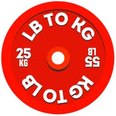

# Bar is Loaded
## Mission
I created this app during my time in quarantine in 2020. I first got the idea for this app after competing in a USAPL powerlifting meet. It was my second meet but first in this federation. Up to the meet, I was training with pound plates and had gotten used to quick maths for loading the bar. However, USAPL uses calibrated KG plates-- on the platform and in the warmup room (depending on venue). Although it's just simple division by 2.2046 to find lb to kg, it was still very annoying. There are a lot of things going on that day and my goal was to have an app to do plate loading calculations with a simple graphic that's easy to follow.

## Features
#### Plate Loading Calculations
* Shows how many plates you need on each side
* Easy to switch between KG or LB plates
* Option to display both KG & LB plates
* KG or LB inputs

#### Customizable Inventory
* Ability to change bar weight, remove clips, tailor the plates to what you have on hand

#### Prep
* 1 rep max calculator based on 1 to 10 reps-- perfect for training maxes
* Suggestions for exercises to tackle sticking points. Each exercise is a link to a short YouTube video
* Enter a weight to display your first, second, and third attempts for meet day

#### Powerlifting Points Calculator
* Enter your total and bodyweight to display
  - Wilks Score
  - IPF Points
  - DOTS Score

#### RPE Calculator
* Enter your weight lifted, reps, RPE to display estimated 1 rep max for that day
* Also shows you the next weight based on desired reps and RPE

#### LB | KG
* Ability to switch between LB or KG inputs throughout the app

## Bug Reports & Feature Requests
[This](https://github.com/dongledan/bar-is-loaded-issue-request/issues) is the public issue tracking system for the Bar is Loaded app. This is the place for feature requests, bug reporting, and general questions regarding the app. For feature requests, please provide a detailed description on what problem you'd like to see solved. For bug reports, please provide the necessary steps to reproduce the problem.

Please search the existing issues page before submitting a new issue, there may already be an issue for your exact problem. You can +1 vote 👍 on existing issues you'd like to see implemented. Thank you for contributing!

* [Bug Report](https://github.com/dongledan/bar-is-loaded/blob/master/.github/ISSUE_TEMPLATE/bug_report.md)
* [Feature Request](https://github.com/dongledan/bar-is-loaded/blob/master/.github/ISSUE_TEMPLATE/feature_request.md)

## Privacy Policy
I don't store your data, period. There is no external database, how many plates you have or how much your barbell weighs is your business.

[Click here for more info](https://github.com/dongledan/bar-is-loaded/blob/master/privacy_policy.md)

## FAQ
#### Who is Henry?
He's a buddy that I just wanted to mess with.

#### How are the weights calculated?
Based on the input weight, it is rounded down to the smallest plate in your inventory (ex. 1.25kg would be rounded to the nearest 2.5kg since 1.25 + 1.25 plates on each end is 2.5 quick maths). I also rounded down because I think it's better to be conservative than to overshoot.

#### Who is this app for?
Any swole people out there who doesn't want to do math, it's leg day-- not brain day. Personally for me, it's when I go to a gym with kg plates or at a meet that uses kg plates. I usually train with lb plates and it'll be one less thing to worry about warming up.

## Links
* [Google Play Store](https://play.google.com/store/apps/details?id=com.dongledan.barisloaded)
* [Apple App Store](https://apps.apple.com/us/app/bar-is-loaded-gym-calculator/id1509374210?ls=1)
* [Developer Website](http://dannyli.us/)
* [/u/dongle-dan](https://www.reddit.com/user/dongle-dan)

